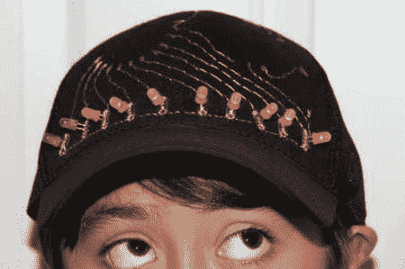

# 气帽感应到你的胀气，并显示在你的额头上

> 原文：<https://hackaday.com/2012/05/04/the-gas-cap-senses-your-flatulence-and-displays-it-on-your-forehead/>

如果你曾经发现自己想知道是否有任何可能的方法让那些嗅觉有缺陷的人知道你有多胀气，不要再想了。[气帽就是为了满足这种需求](http://www.instructables.com/id/Gas-Cap/)。一个各种各样的条形图，位于一顶帽子的前面，它会发光来反映你的，呃，排气口附近检测到的甲烷量。这个项目花费了大约 100 美元，尽管其中很大一部分花在了 Xbee 模块上，这样探测器就可以与帽子分离，从而实现远程放屁通知。

这似乎是一个并不像人们想象的那样不寻常的项目。我们已经看到[屁的强度探测器](http://hackaday.com/2009/05/08/fart-intensity-detector/)以及[当你放屁时提醒世界的推特椅](http://hackaday.com/2009/04/13/twittering-toots-a-chairs-perspective/)。

[途径 [Adafruit](http://www.adafruit.com/blog/2012/05/02/gas-cap/)