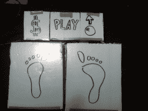
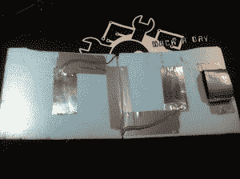
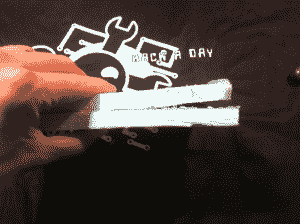
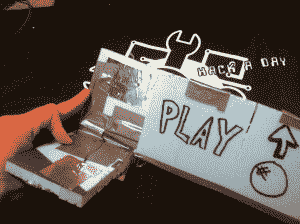
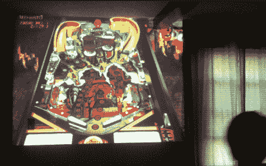

# 弹球跺脚:第二部分

> 原文：<https://hackaday.com/2012/05/07/pinball-stomp-part-2/>

这是这个项目的第二部分，也是最后一部分。如果你还没有看过第 1 部分，[跳回来看看](http://hackaday.com/2012/04/27/pinball-stomp-part1/)。

既然我们已经做好了控制盒并准备好了，我们只需要建立一些简单的踩踏传感器。正如我以前说过的，我怀疑这能吸引任何人的注意力超过一两个晚上。考虑到这一点，我想把它做得尽可能便宜和简单。

要制作这些，您需要以下物品:

*   泡沫板或厚纸板
*   铝带
*   电线
*   管道胶带

就这样…不，真的，就这样。休息后看看视频，看看一切进展如何，以及孩子们对此的看法。

[https://www.youtube.com/embed/a5F8vJnC0pw?version=3&rel=1&showsearch=0&showinfo=1&iv_load_policy=1&fs=1&hl=en-US&autohide=2&wmode=transparent](https://www.youtube.com/embed/a5F8vJnC0pw?version=3&rel=1&showsearch=0&showinfo=1&iv_load_policy=1&fs=1&hl=en-US&autohide=2&wmode=transparent)

正如你在视频中看到的，我已经切割了泡沫板，并用胶带做了一个临时铰链。我在顶端放了一小块海绵来分开两片，但是你也可以用另外一块泡沫板来达到同样的效果。为了让它发挥作用，当有人踩了它时，我需要接触以满足。我能想到的最简单的方法就是在踏脚垫的两面都使用铝带。

 

当有人踩在垫子上时，它会弯曲，让两段铝带在中间相遇，从而闭合电路。它极其简单有效。我还做了一些更小、更容易按的按钮来添加硬币、开始游戏和拉活塞。

在进行了一个快速测试以验证一切正常后，剩下唯一要做的事情就是让孩子们尝试一下。

他们的结论:当我打开音响和投影仪时，他们真的很兴奋。弹球是嘈杂和华而不实的，有这种效果。他们高兴地在垫子上跺脚大约 5 分钟。“爸爸，我们现在可以打开 Xbox 了吗？”

我的妻子认为这很酷，我可以很容易地看到这是一个小聚会上的休闲娱乐。

完成后的想法:我很高兴我做得这么快，这么便宜。如果我花了几天时间构建工业强度的踏脚垫或编写一些花哨的代码，当孩子们想要继续前进时，我可能会感到沮丧而不是开心。此外，如果我要再次制作这些，我会在焊盘上以不同的方式布线。我没有考虑好它们的位置，孩子们一直踩着它们。如果我再做一次，导线将在远离他们的脚的部分离开衬垫，而不是朝向他们的脚。