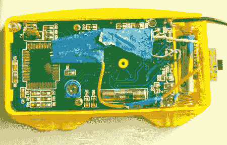

# 升级数字万用表以显示温度

> 原文：<https://hackaday.com/2012/05/04/upgrading-a-digital-multimeter-to-tell-the-temperature/>

[Rajendra]向我们透露了他所做的非常巧妙的事情，让他的万用表能够显示环境温度。他基本上是在测量安装在箱子里的 LM35 温度传感器的输出。电路非常简单，只需要一个传感器、一对电阻和一个开关，就可以恢复正常功能。完成后，你将有一个万用表，当设置到正确的范围(0-200 毫伏)时，它将显示环境温度。开关就在那里，这样你就可以在之后恢复万用表的正常功能。虽然[Rajendra]选择显示环境温度，但你也可以轻松地创建一个外部探头来测量其他东西。