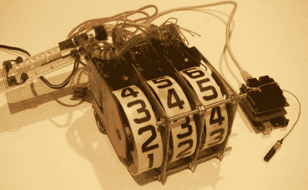

# 使用弹球得分卷轴作为无线显示器

> 原文：<https://hackaday.com/2012/05/05/using-pinball-score-reels-as-wireless-displays/>

[Scott]组装了一个系统，他可以[使用弹球得分卷轴作为无线显示器](http://www.swblabs.com/?p=634)。正如你在下面的视频中看到的，结果真的很整洁。光是声音就让这个镜头在我们的“酷的东西”雷达上占据了相当高的位置。显示器需要 24V 交流电来操作实际上让显示器旋转的螺线管，但他发现 18V DC 电源将允许他启动单个螺线管。没问题，他只是错开了他们的行动。这几乎察觉不到，因为旋转的机械部分需要多长时间才能发生。

你可以下载他的 Arduino 草图，并在他的网站上看到更多。他也有很大的计划，一旦清理完毕，他还会增加 4 个。

[途径 [Adafruit](http://www.adafruit.com/blog/2012/05/04/wireless-pinball-score-reel-control/)

[https://www.youtube.com/embed/EJIdhNJaoeo?version=3&rel=1&showsearch=0&showinfo=1&iv_load_policy=1&fs=1&hl=en-US&autohide=2&wmode=transparent](https://www.youtube.com/embed/EJIdhNJaoeo?version=3&rel=1&showsearch=0&showinfo=1&iv_load_policy=1&fs=1&hl=en-US&autohide=2&wmode=transparent)