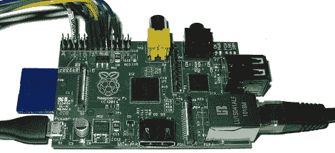

# 用 Web 界面控制 Raspberry Pi 扩展引脚

> 原文：<https://hackaday.com/2012/05/05/controlling-raspberry-pi-expansion-pins-with-a-web-interface/>

对于少数手里拿着树莓 Pi 板的幸运儿来说，你现在可以[使用 GPIO 引脚](http://hobbyelektronik.org/w/index.php/Raspberry_Pi_IO)作为网络接口(德语、[谷歌翻译](http://translate.google.com/translate?sl=de&tl=en&js=n&prev=_t&hl=en&ie=UTF-8&layout=2&eotf=1&u=http%3A%2F%2Fhobbyelektronik.org%2Fw%2Findex.php%2FRaspberry_Pi_IO&act=url))。[Chris]正在把这块神奇的板变成一个可以通过网络让 led 闪烁的小装置，这个小装置可以[播放 1080p 视频](http://hackaday.com/2012/01/24/raspberry-pi-runs-xbmc-reliably-decodes-1080p/)。

构建从 Linux 下的[驱动 GPIO 引脚](http://elinux.org/Rpi_Low-level_peripherals#GPIO_Driving_Example_.28C.29)的例子开始。[Chris]在 Raspberry pi 上拼凑了一些 PHP 和 Javascript。每当他访问 Pi 上的网站时，都会看到几个扩展 IO 引脚的状态和方向。

顺便说一下，[Tony]正在为他的 Pi 构建一个 [GPIO MIDI 接口](http://zuzebox.wordpress.com/2012/03/18/midi-breakout-board-for-raspberry-pi-v0-10/)。是的，他*可以*只需要一个 USB 转 MIDI 适配器就可以了，但这是一个更专业的解决方案，可以满足 RasPi 提供的所有 MIDI 优点。如果你有任何关于你见过的*其他* RasPi 分线板的信息，请发送到[提示行](http://hackaday.com/contact-hack-a-day/)。