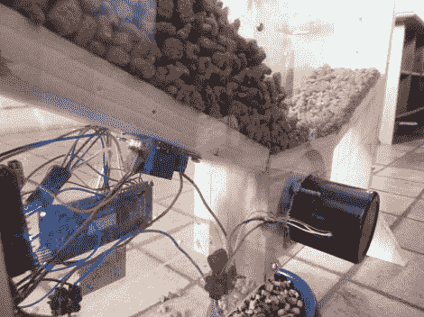

# 用回收的层压机零件制成的自动猫喂食器

> 原文：<https://hackaday.com/2012/05/06/automatic-cat-feeder-made-with-recycled-laminator-parts/>

当[安托万]和他的家人离开家几天，他们通常必须找到一个愿意在他们离开时照顾他们的猫的邻居。为了不打扰住在隔壁的人，他决定最好建一个自动喂猫器。

[Antoine]最初试图建造一个螺旋钻来分配食物，但它并不像他希望的那样工作。他选择用木头做一个分配器，用一个旧的微波炉马达驱动送料轮。马达没有足够的扭矩来完成这项工作，所以他拆除了一个旧的层压机，里面有一个更合适的马达。

他用木头和剩下的丙烯酸薄膜做了一个大漏斗，用来储存猫粮和放置喂食器中使用的所有电子设备。他使用一对按钮和一个小型液晶显示器来控制食物量和喂食间隔，所有这些都由 Arduino Nano 控制。

虽然[Antoine]还没有分享驱动进料器的源代码，但他有一个演示视频，您可以在下面观看。

[https://www.youtube.com/embed/B8Jxw-xC9Vg?version=3&rel=1&showsearch=0&showinfo=1&iv_load_policy=1&fs=1&hl=en-US&autohide=2&wmode=transparent](https://www.youtube.com/embed/B8Jxw-xC9Vg?version=3&rel=1&showsearch=0&showinfo=1&iv_load_policy=1&fs=1&hl=en-US&autohide=2&wmode=transparent)