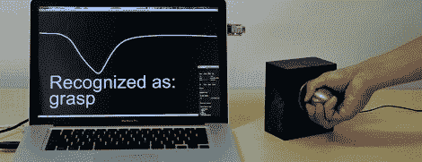

# 把任何东西变成触摸传感器

> 原文：<https://hackaday.com/2012/05/07/turning-anything-into-a-touch-sensor/>

今年在奥斯汀举行的 CHI 会议上，匹兹堡迪士尼研究实验室的[Munehiko Sato]、[Ivan Poupyrev]和[Chris Harrison]展示了他们用任何东西制作[触摸传感器的方法。他们不仅建议使用你的皮肤表面来控制手机和 MP3 播放器，他们还能够识别触摸手势，如戳或抓物体。这听起来有点令人兴奋，所以来看看](http://quantifiedself.com/2012/05/adding-smart-gestures-to-everyday-objects-and-the-human-body/)[touchétech 的视频](http://www.youtube.com/watch?feature=player_embedded&v=E4tYpXVTjxA)。

像我们手机和平板电脑中的电容式触摸传感器一样，Touché测量电容器电荷随时间的上升和下降。与其他触摸传感器不同，Touché以不同的速率扫描电容器，允许用于识别触摸手势的“电容剖面”。

这项技术的应用几乎数不胜数；该团队展示了用筷子(是的，我们知道……)责骂某人吃麦片，一个随身音乐播放器界面，以及一个办公室门把手的手势，如果你出去一分钟或离开一天，它会通知路人。

这是一个非常有趣的构建，我们给它两周的时间，直到有人复制这个构建。我们到时一定会把它寄出去。

[https://www.youtube.com/embed/E4tYpXVTjxA?version=3&rel=1&showsearch=0&showinfo=1&iv_load_policy=1&fs=1&hl=en-US&autohide=2&wmode=transparent](https://www.youtube.com/embed/E4tYpXVTjxA?version=3&rel=1&showsearch=0&showinfo=1&iv_load_policy=1&fs=1&hl=en-US&autohide=2&wmode=transparent)