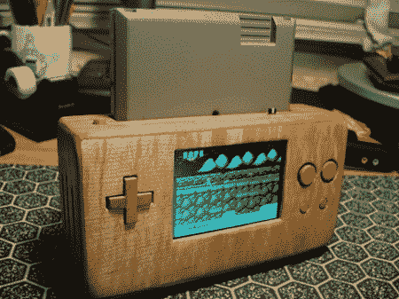

# 便携式 NES 的漂亮木箱

> 原文：<https://hackaday.com/2012/05/07/beautiful-wooden-case-for-a-portable-nes/>

在构建了几个便携式游戏系统后，[Parker]想尝试一些与通常光滑的塑料构建稍有不同的东西。他决定选择一款精致的木制经典 NES。他开始在芯片上挖掉 NOAC 或任天堂的内脏。NOAC 已经为他做了大部分的小型化工作，所以他主要关注的是便携性。虽然这不是最极端的模式，但它也不仅仅是一个案例交换。他拍下了修改屏幕工作并将所有东西放在一起的过程。最终产品看起来棒极了。

我们想到的第一个评论是，为什么游戏面向后？由于 NOAC 板的形状，他可能不得不增加外壳的深度，或者延长并翻转实际的墨盒插头，使游戏面朝前，所以我们可以理解他为什么不动它。