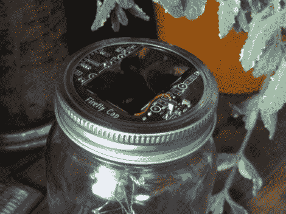

# 萤火虫帽没有电池，是用于室内采光的

> 原文：<https://hackaday.com/2012/05/07/firefly-cap-has-no-battery-and-is-meant-for-indoor-light-harvesting/>

[迈克尔·奥斯曼]来信炫耀他的最新项目。他称之为萤火虫帽，我们认为这是一种文字游戏。你可以看到它充当了梅森罐的盖子，但它也使用了超级盖子，而不是可充电电池。

关于火焰瓶的帖子可以追溯到很久以前。[Michael]提到类似的 firefly 项目是他的第一个嵌入式项目。这个概念使用悬挂在罐子里的发光二极管。当光探测器感应到目标的黑暗程度时，里面的灯就像它们的昆虫一样开始闪烁。

我们喜欢这种设计有两个原因。它旨在收集室内环境的光线，因此您不必担心将它放在阳光下。它使用一个超级电容器而不是电池，所以它应该真正保持运转，而不会磨损储能元件。我们还喜欢这样一个事实，尽管[这是一个 Kickstarter 项目](http://www.kickstarter.com/projects/mossmann/firefly-cap)，但是你构建自己的项目所需要的一切已经可以在[的 Github 库](https://github.com/mossmann/fireflycap)中获得。