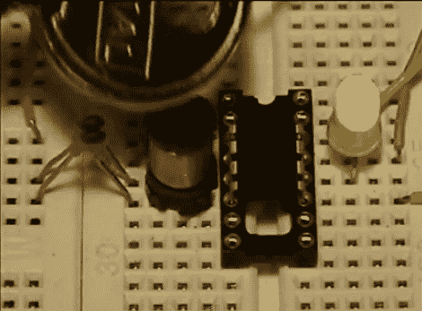

# 使用电感代替时钟晶体进行金属检测。

> 原文：<https://hackaday.com/2012/05/08/metal-detection-using-an-inductor-instead-of-a-clock-crystal/>

几年前的这个项目是对金属探测器的有趣尝试。[Bruno Gavand]没有构建检测电路，而是用电感取代了外部时钟晶体。这里你可以看到 PIC 12F683 旁边的电感线圈。你可以看到两个组件从一个试验板跳到另一个。这些是电感线上的平滑电容。

芯片的看门狗定时器由内部 RC 振荡器运行。当外部晶振接收到由于金属在线圈中感应电流而产生的脉冲时，看门狗定时器的值会与之进行比较。该数据经过过滤，如果参数正确，绿色 LED 会闪烁。这是双色 LED。如果电感电路工作正常，它将在通电时闪烁红光。[Bruno]说，结果会因感应器而异，因此您可能需要尝试几次，让校准灯闪烁。

我们认为这将成为一个简单的螺柱探测器(通过检测钉子/螺钉在墙上的位置)。休息后看看演示，然后留下评论让我们知道你会用它做什么。

[https://www.youtube.com/embed/usPjDbKQkRw?version=3&rel=1&showsearch=0&showinfo=1&iv_load_policy=1&fs=1&hl=en-US&autohide=2&wmode=transparent](https://www.youtube.com/embed/usPjDbKQkRw?version=3&rel=1&showsearch=0&showinfo=1&iv_load_policy=1&fs=1&hl=en-US&autohide=2&wmode=transparent)

[谢谢 Abend]