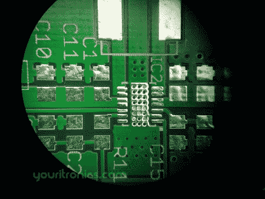

# 你的印刷电路板是否如声称的那样被测试？

> 原文：<https://hackaday.com/2012/05/10/are-your-pcbs-being-tested-as-claimed/>

Florin 从一家 pcb 原型服务公司 Iteadstudio 订购了一些 PCB。作为他们服务的一部分，他们声称所有的多氯联苯在交付前都经过测试。然而，许多人对这种说法提出了质疑。[Florin] [发现完全没有任何标记](http://www.youritronics.com/iteadstudio-false-electrical-test/)表明他的电路板上使用过真正的探针。虽然他们声称 100%的电路板都经过了电子测试，但他们对他的询问的回答有些神秘。

> 所有的 pcb 边缘都有条纹，这并不意味着它们都经过了电气测试，这与外形相同。

危险原型论坛上的人们已经发现了类似的结果。该公司在本页上[表示，他们将很快对此做出回应(早在二月)](http://iteadstudio.com/other/how-itead-make-your-pcb-prototype/)