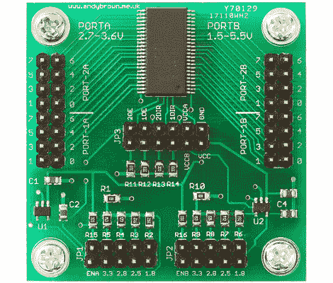

# 有大量选项的级别转换

> 原文：<https://hackaday.com/2012/05/09/level-conversion-with-plenty-of-options/>

[安迪·布朗]想要一个电平转换器来统治他们所有人，所以他着手[建造自己的转换器，其中包括大量选项](http://andybrown.me.uk/ws/2012/05/07/level-converter/)。

顶部和中间的芯片是一个非常小巧的装置。是恩智浦 74ALVC164245DL。除了有一个令人难以置信的长和看起来毫无意义的零件号，它还包含一对双向八进制端口。它运行速度非常快(约 333 MHz)，一端支持高达 5V 的电压，另一端支持高达 3.3V 的电压。只要你保持在这些最大值以下，你就可以选择你自己的目标电压。为此，他内置了两个利用跳线设置的可调电压 LDO。

但是等等，[安迪]还没有完成。如果跳线不提供您正在寻找的目标电压，他还包括中断引脚，以便您可以使用外部电源注入电压。他甚至可以选择单独使用 LDO，而不使用电平转换器。你如何保持所有这些配置的直线？他构建了一个小的 web 表单，让您设置所需的参数，并告诉您应该连接哪个跳线。