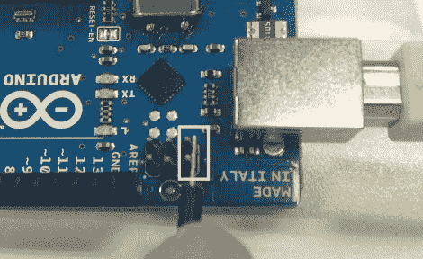

# UnoJoy 让你的 Arduino 与 Xbox 360 或 PS3 玩得很好

> 原文：<https://hackaday.com/2012/05/09/unojoy-makes-your-arduino-play-well-with-xbox-360-or-ps3/>

我们以前见过基于 Arduino 的游戏控制器，但 UnoJoy 项目希望让你更容易将它们插入游戏控制台。

该项目针对 Arduino UNO。为什么只有那个硬件 Arduino 不是通用的吗？是的，但是在这种情况下，引导装载程序需要被覆盖，这样 Arduino 将在你的游戏系统中被列为一个被认可的控制器。这里，设备被置于 DFU 模式，为闪存做准备。

一旦这一部分完成了，是时候开始你自己的硬件接口了。UnoJoy 库提供了将控制器数据推送到游戏控制台所需的所有钩子，由您使用 Arduino IDE 来决定这些事件何时发生。这将是一个让[弹球停止控制器](http://hackaday.com/2012/05/07/pinball-stomp-part-2/)与 Xbox Live 街机游戏协同工作的绝佳机会。或者休息之后看看[Alan Chatham]使用该库来控制 gt 赛车，就像它是一款 NES Power Pad 游戏一样。

[https://www.youtube.com/embed/Gaw6thWbKQg?version=3&rel=1&showsearch=0&showinfo=1&iv_load_policy=1&fs=1&hl=en-US&autohide=2&wmode=transparent](https://www.youtube.com/embed/Gaw6thWbKQg?version=3&rel=1&showsearch=0&showinfo=1&iv_load_policy=1&fs=1&hl=en-US&autohide=2&wmode=transparent)