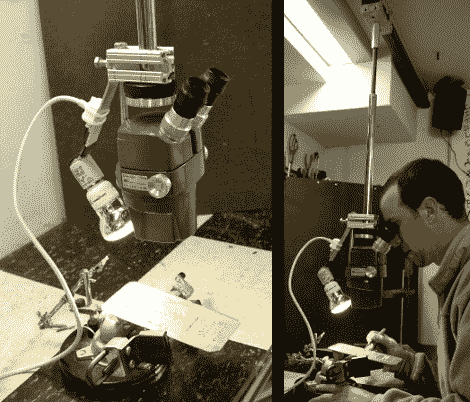

# 飞行显微镜对家庭实验室来说似乎太好了

> 原文：<https://hackaday.com/2012/05/09/flying-microscope-build-seems-way-too-nice-for-a-home-lab/>

这个飞行显微镜是一个让[达雷尔·泰勒]非常自豪的工具。他想拥有一台用于表面贴装项目的检验显微镜。他得到了一部歌舞片的双筒版本，因为它没有支架。最初，他建造了一个简单的钻机，但如果它不在正确的位置，它会对身体造成很大影响，而且直立部分会妨碍更大的项目。

这一次，他使用了悬挂轨道系统，而不是支架。他手头上有一些铝轨道，原本是用来滑动玻璃门的。他制作了一个手推车来连接轨道，并增加了一个垂直杆来支撑显微镜。这使得不使用时可以很容易地将单元滑动到侧面，并提供一些高度调节。为了增加功能性，他在瞄准镜的对面装了一盏灯。这使项目保持照明，没有阴影被他的手或范围本身投下。