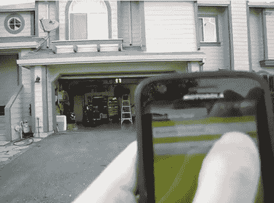

# 一个更简单的机器人车库门开启器

> 原文：<https://hackaday.com/2012/05/10/a-much-easier-take-on-an-android-garage-door-opener/>

通过这个项目，[安迪]正在把智能手机控制的车库门的复杂性降低一个档次。他对使用视频信号检查[门的状态(开或关)不感兴趣，也不想从世界任何地方控制这个东西。他只是想用他的机器人作为遥控器，我们对此表示赞同。](http://hackaday.com/2012/03/01/monitoring-and-controlling-your-garage-door-from-afar-with-an-ip-camera/)

车库里的电路很简单。继电器用于模拟车库有线开启器上的按钮按压。该继电器由 Arduino 驱动，Arduino 使用蓝牙屏蔽进行连接。由于他的 Android 手机有一个蓝牙调制解调器，该项目的其余部分只是应用程序开发。正如你在视频中看到的，该应用程序在启动时会自动连接到 Arduino，然后等待按钮按下以发送电子版的“芝麻开门”。

该项目涵盖了一系列帖子，因此如果你想了解他是如何开发并运行该应用程序的，请务必浏览他的档案。这个应用程序的下一个版本需要是一个背景小部件，支持蓝牙，连接到 Arduino，发送打开命令，所有这些都只需按一下。

[https://www.youtube.com/embed/cD2ktMTmljU?version=3&rel=1&showsearch=0&showinfo=1&iv_load_policy=1&fs=1&hl=en-US&autohide=2&wmode=transparent](https://www.youtube.com/embed/cD2ktMTmljU?version=3&rel=1&showsearch=0&showinfo=1&iv_load_policy=1&fs=1&hl=en-US&autohide=2&wmode=transparent)