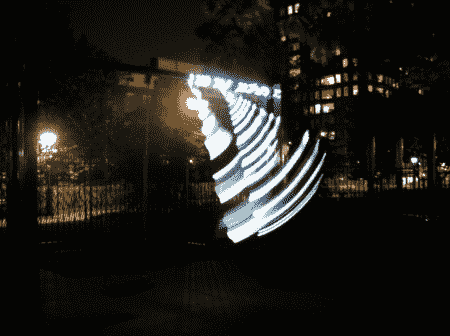

# 用摇摆装置发电

> 原文：<https://hackaday.com/2012/05/11/generating-electricity-with-swing-sets/>

[Guelherme Pena Costa]想出了一个主意[点亮一个秋千，利用人们在上面荡秋千的动作来发电](http://1gram.posterous.com/night-swing)。我们的目标是让人们在晚上享受游乐场，我们认为，这实际上可能是实现这一目标的一个很好的方式。人们喜欢闪光灯，尤其是如果它们是交互式的。

为了点亮 LEd 灯绳，[Guelherme]在秋千的框架上安装了一个齿轮马达，在链条上安装了一个臂。当秋千摆动时，它使电机旋转，产生 6 到 10 伏的电压，电流为 230-400 毫安。正如你在下面的视频中看到的，这很好地点亮了 led，尽管我们认为让灯保持更长时间点亮的充电电路也很酷。