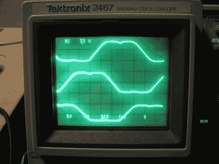

# 首次尝试使用无刷 DC 电机。

> 原文：<https://hackaday.com/2012/05/12/the-trials-of-working-with-brushless-dc-motors-for-the-first-time/>

 我们都曾与 DC 汽车公司合作过。即使你不是一个硬件爱好者，你也可能至少在小时候拿起过一个马达，把电池接触导线，让它转动起来。这些通常是标准的 DC 电机，而不是他们的无刷亲戚。无刷电机需要更多的工作，因为你是手动控制的东西，通常是照顾与刷子。这篇文章不会教你怎么做，相反，它会向你展示一个人在就职努力中犯的错误。这有点有趣，但他用它们做的项目总结似乎更有趣。

> 在过去的六个月里，这份工作一直在支付我的账单，并让我远离艺术气息浓厚的电路，它包括为某个非常豪华的人的房子制作一套这些巨大的机器人门。每扇门高 13 英尺，宽约 7 英尺，重 1500 磅。有 66 个在所说的房子，和更多的仆人宿舍(！？！).每扇门上的电路必须处理运行机载空气压缩机(调节气动防风雨密封)以及跟踪温度，以便在天气变冷时线性化压力传感器。他们还必须对密封的铅酸电池进行充电和维护。他们已经换向了电源轨。它们必须通过所述电源轨进行通信，并且要使用容性耦合数据限幅器和我编写的专有协议。这个协议必须足够健壮以引导处理器。这是一项合适的嵌入式系统工作。

哇哦。

[途径 [Adafruit](http://www.adafruit.com/blog/2012/05/03/bldcs-the-wrong-way/)