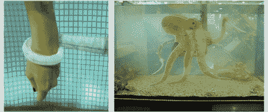

# 章鱼计划

> 原文：<https://hackaday.com/2012/05/10/project-octopus/>

你知道谁认为制造一只机器章鱼是个很棒的主意吗？所有人。很明显，这个想法非常可靠，欧洲委员会已经资助了这个项目。目标是模仿头足类动物最柔软的能力，以推进软机器人技术。或者有可能接管世界。他们希望有一个完全没有刚性结构的机器人章鱼。

你可能认为制造蠕动的触手是件容易的事。然而，他们尝试的是章鱼的实际运动，包括伸展/收缩以及抓取。这需要一个复杂的控制线系统以及“人造肌肉液压器”来完成所有这些动作。覆盖着传感器的柔性皮肤将被添加到最终设计中。