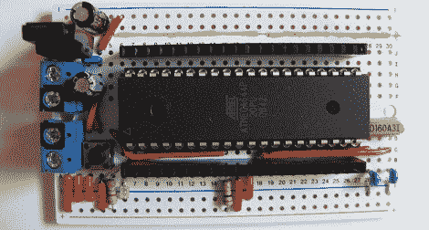

# 更多的别针和更多的权力

> 原文：<https://hackaday.com/2012/05/13/more-pins-and-more-power-with-a-diy-sanguino/>

在[CulinarilySpeaking]进入 Arduino 游戏后不久，他开始想要更多的 IO 引脚和更大的程序空间来进行更雄心勃勃的项目。当然，这使他走上了 Sanguino 的道路，这是一款基于 ATMega644 的开发板，其 IO 引脚比基于 ATMega328 的 Arduino 板多得多。不买新的，而是决定自己做血，结果看起来棒极了。

在网上浏览零件时偶然发现了一台 ATMega644 之后，[库林纳利·斯帕克]发现这台微型电脑有足够的电源和引脚来做一些相当复杂的事情。一群其他人之前考虑过在 Arduino 环境中使用这种芯片，所以[库林纳利发言]所要做的就是用他手头的部件复制电路。

将所有组件焊接到整洁的试验电路板式 PCB 上后，[CulinarilySpeaking]启动 Arduino IDE，并将 Blink 示例安装到 644 上。一切都正常，所以现在有了一个比标准 Arduino 功能更强大的主板，只需要 8 美元的零件。

via [reddit](http://www.reddit.com/r/arduino/comments/tgfvk/my_diy_sanguino_pic_and_tutorial/)