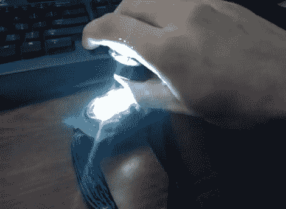

# 用网络摄像头和手电筒监控你的心跳

> 原文：<https://hackaday.com/2012/05/11/monitor-your-heartbeat-with-a-webcam-and-a-flashlight/>

在看到一些使用手机摄像头和闪光灯功能的 Android 心率监测应用程序后，[泰森]接受了为自己编写代码的挑战。但是他没有使用智能手机，而是拿了一个头灯和摄像头作为他的热耗监测器。

首先，他用自己的智能手机录制了一段测试视频，看看用拇指盖住闪光灯 LED 和相机模块是什么样子。这张照片主要是粉红色的，但很明显有一个颜色梯度，随着血液流过他的皮肤而跳动。下一个任务是编写一些过滤软件，可以利用这种来自网络摄像头的图像。他使用 C#编写了一个 GUI 来显示实时提要，以及处理后数据的滚动图。他尝试了几次，休息后我们嵌入了一个早期的作品。

[https://www.youtube.com/embed/7hZRheyBJCg?version=3&rel=1&showsearch=0&showinfo=1&iv_load_policy=1&fs=1&hl=en-US&autohide=2&wmode=transparent](https://www.youtube.com/embed/7hZRheyBJCg?version=3&rel=1&showsearch=0&showinfo=1&iv_load_policy=1&fs=1&hl=en-US&autohide=2&wmode=transparent)