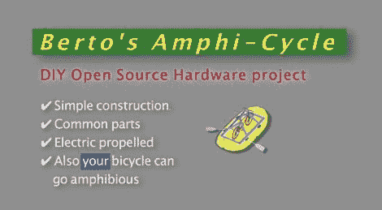

# 两轮自行车可以让你沿着小径、海浪骑行，然后再返回

> 原文：<https://hackaday.com/2012/05/14/amphi-cycle-lets-you-ride-the-trails-the-waves-and-back-again/>

Hackaday regular [Berto]总是在寻找新的出行方式，并写信分享了他最近的创作，[一辆水陆两用自行车。](http://www.youtube.com/watch?v=YKN20Vc4bnE)

他买了一艘现成的充气船，并建造了一个钻机，让他可以稳定地将自行车安装在上面。一旦[Berto]遇到他想穿过的水域，他所需要的只是大约 7 分钟的时间来给船充气和系上他的自行车。使用我们去年见过的他的[基于电钻的拖曳马达](http://hackaday.com/2011/09/07/engine-hacks-electric-drill-made-into-a-trolling-motor/)的改进版本，自行车毫不费力地滑过水面，正如他的助手在下面的视频中演示的那样。

目前，该船仅由拖曳马达和一个大型铅酸电池驱动。我们希望看到骑自行车的人驱动自行车，尽管我们不知道这将如何影响“一船适合所有人”的设计(Berto)的目标。

[https://www.youtube.com/embed/YKN20Vc4bnE?version=3&rel=1&showsearch=0&showinfo=1&iv_load_policy=1&fs=1&hl=en-US&autohide=2&wmode=transparent](https://www.youtube.com/embed/YKN20Vc4bnE?version=3&rel=1&showsearch=0&showinfo=1&iv_load_policy=1&fs=1&hl=en-US&autohide=2&wmode=transparent)