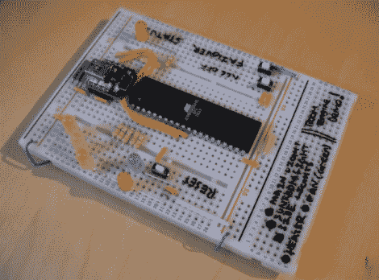

# 智能手机或语音控制的 Arduino 兼容家庭自动化

> 原文：<https://hackaday.com/2012/05/14/arduino-compatible-home-automation-for-smart-phone-or-voice-control/>

[Joseph]来信分享了他在大学项目中开发的家庭自动化系统。他称之为房间引擎，硬件的室内部分是建立在你在这里看到的电路之上的。这是 REBoard 最基本的部分，它意味着使用 RS232 或 USB 连接到计算机，并进而使用一组继电器来切换电源电压设备。

你可以关注他的网页上的面包屑，以获得该系统的更广泛的视频。该界面设计为使用两部分。一个是由计算机支持的语音识别系统。另一个是 iOS 界面，包括登录凭证和基于按钮的控制系统。休息后的视频展示了控制器的智能手机部分。我们认为他在整合一些设备方面做得很好，不需要 X10 模块等商业产品。

如果你只是想在没有电线的情况下交换一些东西，这可以完成，并提供调度功能。这也很容易用 WiFi 模块来设置，而不用 PC。

[https://www.youtube.com/embed/6Dgvuo1r5_c?version=3&rel=1&showsearch=0&showinfo=1&iv_load_policy=1&fs=1&hl=en-US&autohide=2&wmode=transparent](https://www.youtube.com/embed/6Dgvuo1r5_c?version=3&rel=1&showsearch=0&showinfo=1&iv_load_policy=1&fs=1&hl=en-US&autohide=2&wmode=transparent)