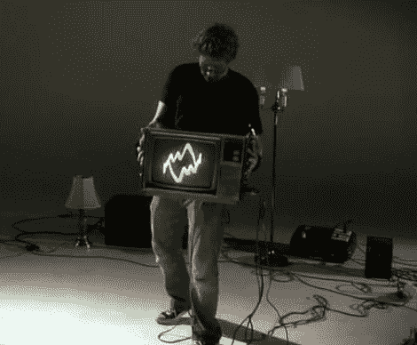

# 你玩这个模拟电视合成器会扭伤后背的

> 原文：<https://hackaday.com/2012/05/15/youll-throw-your-back-out-playing-this-analog-tv-synth/>

随着越来越多的人采用平板电视，CRT 电视被弃之一旁，大量闲置的电视机给了黑客/艺术家[凯尔·埃文斯]无限数量的模拟画布来投射他的视觉。他最近来信分享他的最新作品，他称之为“de/Rastra”。

他称之为“CRT 性能界面”,是一台老式的模拟电视，他对其进行了改造，以显示移动电视所产生的信号。该显示器配有一系列力传感器、加速度计和开关，由手持该装置的人的运动动态生成。

在一对 XBee 无线电的帮助下，信号从他的传感器阵列无线发送到 Atmel 328 微控制器，在那里它们被分析并用于生成一系列音频流。这些信号在进入阴极射线管的磁轭之前被输入一个 400W 的放大器，随后显示在屏幕上。

我们肯定[凯尔]可能试图表达一个复杂的隐喻，关于人类徒劳地试图通过他的项目来控制技术，但我们认为这只是看起来很酷。

在下面的视频中看看[凯尔的]作品，并在评论中给我们你的看法。

[https://www.youtube.com/embed/cZzbRoJkIBo?version=3&rel=1&showsearch=0&showinfo=1&iv_load_policy=1&fs=1&hl=en-US&autohide=2&wmode=transparent](https://www.youtube.com/embed/cZzbRoJkIBo?version=3&rel=1&showsearch=0&showinfo=1&iv_load_policy=1&fs=1&hl=en-US&autohide=2&wmode=transparent)