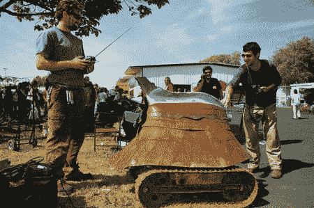

# 采访[贾斯汀·格雷]

> 原文：<https://hackaday.com/2012/05/15/an-interview-with-justin-gray/>

说到黑客这个话题，我们对于什么是最酷的都有不同的看法。有些人喜欢钻头和焊料，有些人喜欢锤子和火。[贾斯汀·格雷]通过将两者广泛融合而为自己赢得了名声。[justin]主要以他的火雕塑机器人而闻名，他还有一个制造电动摩托车的 fab 店。

《Make》杂志最近做了一次有趣的采访，采访中展示了一些很棒的图片，展示了一些[贾斯汀]的作品。

贾斯汀给有抱负的黑客的建议是:

> **9。你对受到你作品启发的年轻创客有什么建议？**
> 我认为受到我作品启发的人应该决定建造并致力于建造，不要再听从那些坚持走正常生活路线的人。对孩子们来说，继续玩，继续想象，继续绘画和艺术创作。

休息后加入我们来看看机器人拆除的乐趣。

[https://www.youtube.com/embed/7utqhUDkuEc?version=3&rel=1&showsearch=0&showinfo=1&iv_load_policy=1&fs=1&hl=en-US&autohide=2&wmode=transparent](https://www.youtube.com/embed/7utqhUDkuEc?version=3&rel=1&showsearch=0&showinfo=1&iv_load_policy=1&fs=1&hl=en-US&autohide=2&wmode=transparent)