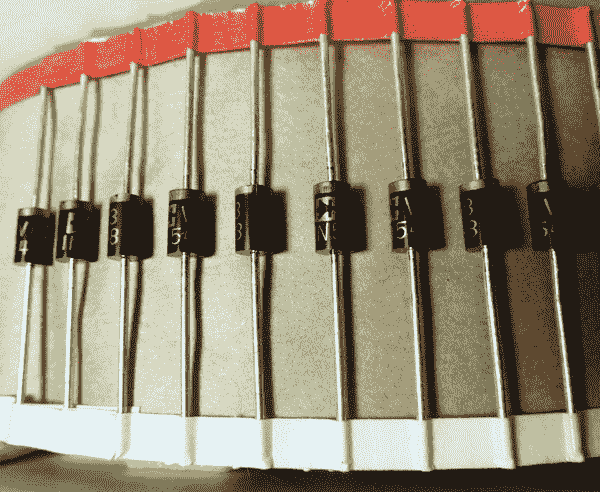
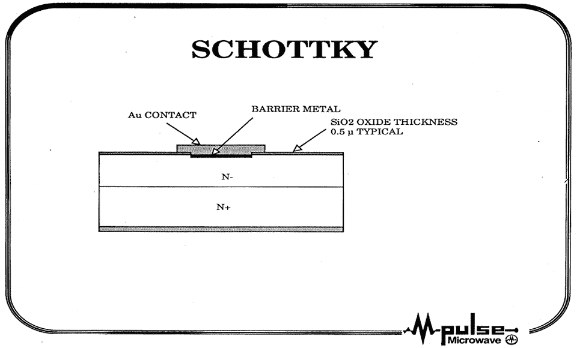

# 关于二极管的更多信息

> 原文：<https://hackaday.com/2012/05/17/a-bit-more-about-the-diode/>

上周[我们讨论了二极管](http://hackaday.com/2012/05/08/a-bit-about-the-diode/)，特别是热离子和 PN 结二极管。但是哦，还有更多；他们很特别！

最常用的“专业”二极管之一是金属半导体结型二极管。由于金属的功函数比半导体晶体低，电子倾向于从金属流向晶体，可以制成二极管。这些**晶体整流器**实际上早于硅和热离子二极管，并且一度非常普遍。以至于旧的原理图[将二极管标识为‘CR’而不是‘D’](http://www.circuitsarchive.oimg/f/f8/Cir_solorb_cdv700-6b-schem.jpg)。

晶体整流器今天仍在使用，尽管数量少得多。尽管这些二极管通常工作不佳，但它们的压降非常低，而且绝对没有反向恢复时间。这使得它们非常适合 RF 应用；比如丙类放大器和无线电探测器。事实上，你很难找到一个没有调谐电容的收音机。

也就是说，点接触晶体整流器对于大信号和高频整流几乎完全无用。幸运的是，我们有一个现代的对等物可以执行这些任务；**肖特基二极管**

在操作上，这些二极管与晶体整流器没有什么不同，但现代制造技术允许我们将金属阴极直接焊接到硅上，从而创造出比尖针所能达到的更大的接触面积。因此，我们获得了晶体整流器的所有低电压优势，以及 PN 结的所有高电流优势。以 150kHz 整流 200 安培？没问题。

但是如果这些都不够快呢？1Ghz 远远不够！嗯，总有隧道二极管。

隧道二极管与 PN 二极管并没有太大的不同，事实上它们也是 PN 二极管。与普通整流器不同，隧道二极管掺杂非常、非常重，因此带隙非常小，电容和恢复时间也非常小。

隧道二极管是狡猾的小动物。随着二极管正向偏压的增加，电子开始隧穿势垒，但随着电压进一步增加，流动的电子会减少，从而形成负电阻。通过进一步增加电压，建立正常的二极管操作。

这个负电阻区不仅允许二极管整流微波，还可以产生微波。有了合适的 LC 储能电路，就有可能[制作一个带隧道二极管的微波发生器](http://hyperphysics.phy-astr.gsu.edu/hbase/electronic/ietron/tundio2.gif)，或者一个微波放大器，如果你真的够大胆的话。尽管它们不是很棒的振荡器，但它们确实有效。

虽然有一个更好的二极管，但那是下周的事了…