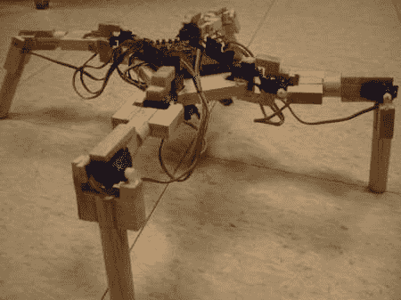

# 基于 Arduino 的四足机器人

> 原文：<https://hackaday.com/2012/05/27/an-arduino-based-quadruped-robot/>

当然，我们在[HAD]经常看到六足动物，但是用四条腿四处移动在运动学上可能更复杂。这本说明书向你展示如何用轻木制作一个。

虽然人们可能不会想到巴尔萨用[vexedpheonix]制造他们的机器人，但他解释说，之所以选择这种材料，是因为它非常轻，而且易于操作。因为他试图降低成本，所以使用了最便宜的伺服系统。这些都不是那么强大，所以身体越轻越好！根据随附的[材料清单](http://www.instructables.com/id/Arduino-Based-Four-Legged-Robot/step2/Equipment-and-Supplies/ "bill of materials")，他能够将整个机器人的造价控制在 100 美元以下。

根据这篇文章，最困难的部分是复制同一条腿的四份拷贝。我们可能会建议使用一台 [CNC 路由器](http://hackaday.com/2011/09/01/building-a-cnc-router-to-call-my-own/ "building a CNC router to call my own")，但是建造一台显然会给项目增加一层巨大的复杂性！

谢谢你的建议[SteveT]！一定要看看这个小机器人在休息后挥动一条腿或试图走路的视频！

[https://www.youtube.com/embed/Hj4JvLvztLs?version=3&rel=1&showsearch=0&showinfo=1&iv_load_policy=1&fs=1&hl=en-US&autohide=2&wmode=transparent](https://www.youtube.com/embed/Hj4JvLvztLs?version=3&rel=1&showsearch=0&showinfo=1&iv_load_policy=1&fs=1&hl=en-US&autohide=2&wmode=transparent)
[https://www.youtube.com/embed/UvTE_WAhqBg?version=3&rel=1&showsearch=0&showinfo=1&iv_load_policy=1&fs=1&hl=en-US&autohide=2&wmode=transparent](https://www.youtube.com/embed/UvTE_WAhqBg?version=3&rel=1&showsearch=0&showinfo=1&iv_load_policy=1&fs=1&hl=en-US&autohide=2&wmode=transparent)

如果你更想看六足机器人的行动，为什么不试试这个呢？