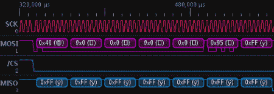

# 将示波器变成逻辑分析仪

> 原文：<https://hackaday.com/2012/05/16/turning-an-oscilloscope-into-a-logic-analyzer/>

迟早，你会需要一个逻辑分析仪。如果你周围没有总线盗版或逻辑嗅探器，[Joonas]有一个很棒的 MacGyverism，可以将示波器变成有史以来最简单的逻辑分析仪。

构建的基本前提是将四条数字线连接到示波器的模拟输入端。这是通过 74HC126 缓冲器实现的，该缓冲器为逻辑探针提供高阻抗输入，并输出每个逻辑通道的 4 位状态。利用 R-2R 网络中的几个电阻，可以轻松读取四条数字线路的状态。

[Joonas]包括了将他的 Picoscope 2000 变成逻辑分析仪的源代码，但是没有理由为什么这不能用任何具有串行输出的数字示波器来完成。对于一个非常非常简单的逻辑分析仪来说，这已经不错了，只需要一个芯片和几个电阻，成本不到 5 美元。