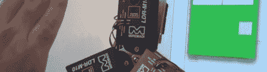

# 激光雷达三维姿态跟踪

> 原文：<https://hackaday.com/2012/05/16/3d-gesture-tracking-with-lidar/>

[Reza]已经研究用激光雷达探测手势大约 10 年了，我们不得不说最终结果是值得等待的。

该建筑使用三个小型激光雷达传感器来测量到一个物体的距离。这些传感器的工作原理是发出红外脉冲，并记录光束发射并反射回光传感器的飞行时间。基本上，它是雷达，但带有红外线。其中三个激光雷达传感器安装在一个支架上，并插入 Arduino Uno。通过测量物体到每个传感器的距离，[Reza]可以确定物体在 3D 空间中相对于传感器的位置。

与我们见过的基于 Kinect 的手势应用不同，[Reza]的激光雷达可以在阳光下工作。因为每个激光雷达传感器每秒测量一百万次距离，所以它的响应速度也比 Kinect 快得多。对于 10 年的工作来说还不错。

你可以看看[Reza]的手势控制演示，以及休息后他的激光雷达硬件的几个演示。

[https://www.youtube.com/embed/6_Ornv-NlEk?version=3&rel=1&showsearch=0&showinfo=1&iv_load_policy=1&fs=1&hl=en-US&autohide=2&wmode=transparent](https://www.youtube.com/embed/6_Ornv-NlEk?version=3&rel=1&showsearch=0&showinfo=1&iv_load_policy=1&fs=1&hl=en-US&autohide=2&wmode=transparent) [https://www.youtube.com/embed/nk2xY3usY0k?version=3&rel=1&showsearch=0&showinfo=1&iv_load_policy=1&fs=1&hl=en-US&autohide=2&wmode=transparent](https://www.youtube.com/embed/nk2xY3usY0k?version=3&rel=1&showsearch=0&showinfo=1&iv_load_policy=1&fs=1&hl=en-US&autohide=2&wmode=transparent) [https://www.youtube.com/embed/ACVx70x8mtg?version=3&rel=1&showsearch=0&showinfo=1&iv_load_policy=1&fs=1&hl=en-US&autohide=2&wmode=transparent](https://www.youtube.com/embed/ACVx70x8mtg?version=3&rel=1&showsearch=0&showinfo=1&iv_load_policy=1&fs=1&hl=en-US&autohide=2&wmode=transparent)