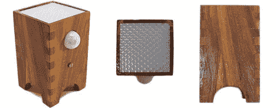

# 运动感应 RGB 灯可待机 3 年

> 原文：<https://hackaday.com/2012/05/16/motion-sensitive-rgb-lamp-can-standby-for-3-years/>

哦，漂亮的围栏！这是一个小小的动作感应灯，是几年前作为母亲节礼物制作的。PIR 传感器很容易在表壳正面看到白色圆顶。但是仔细看下面，你会看到它用来在白天保持睡眠的 LDR。这是为了节省电池，但原来的版本仍然通过疯狂吃他们。今年，他对其进行了彻底改造，设计出了一种更加节能的设计。

他转而使用 TLC1079 运算放大器，从 PIR 传感器读取数据时，该放大器大大降低了功耗。微控制器也从 ATtiny13 升级到 ATmega328，使新版本 Arduino 兼容。它使自己进入睡眠状态，白天不开灯，功耗仅为 0.08 mA。当驱动 RGB LED 时，灯消耗大约 50 毫安。三节 AA 电池应该还能维持一段时间，但我们仍然建议使用可充电电池。

[https://www.youtube.com/embed/T0-zNYG0B0U?version=3&rel=1&showsearch=0&showinfo=1&iv_load_policy=1&fs=1&hl=en-US&autohide=2&wmode=transparent](https://www.youtube.com/embed/T0-zNYG0B0U?version=3&rel=1&showsearch=0&showinfo=1&iv_load_policy=1&fs=1&hl=en-US&autohide=2&wmode=transparent)