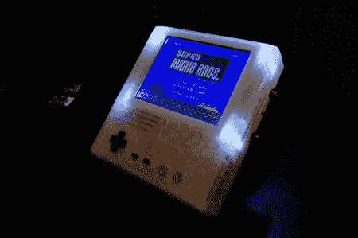

# 3d 打印 Nes 便携看起来棒极了，不含热胶

> 原文：<https://hackaday.com/2012/05/17/3d-printed-nes-portable-looks-fantastic-and-contains-no-hot-glue/>

[Parker]今天发邮件给我们展示他最新的 NES 便携式产品。这一次，他使用的是标准的“顶装”NES，而不是通常使用的片上 NES。这很酷，因为片上 NES 与一些游戏存在兼容性问题。对于屏幕，他使用了普通的 PSone 屏幕，并进行了轻微的功率修改。出厂时屏幕取 7.4 V，转换下来 5V 使用。他去掉了这个，直接用他自己的 5V 电源运行。这看起来没什么大不了的，但是对于笔记本电脑来说，每一点都很重要。他还放弃了 PSone 屏幕上的声音放大器，取而代之的是更高效的东西。他看起来做得很好，因为他说现在满负荷大概有 10 个小时。

这种设计的另一个很酷的方面是，墨盒可以作为一种设备的支架，尽管这样使用时按钮的位置看起来可能有点尴尬。