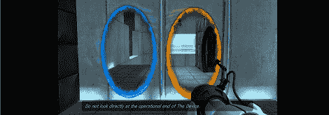

# 用 Kinect 制作现实生活中的门户

> 原文：<https://hackaday.com/2012/05/19/making-real-life-portals-with-a-kinect/>

[radicade]想知道现实生活中的门户会是什么样子；不是游戏里的东西，而是他客厅墙上真正的蓝色和橙色入口。除了建造传送门炮，【radicade】唯一可用的选择是[用 Kinect 和投影仪模拟一对传送门](http://radicade.posterous.com/real-life-portals-using-a-projector-and-a-kin)。

传送门的一个更有趣的特性是能够看穿另一边——你可以透过蓝色传送门，从橙色传送门的有利位置看世界。[radicade]使用 Kinect 的头部跟踪功能模拟了门户的视角。

Kinect 抓取一个房间的深度图，并计算通过一个门户窥视会是什么样子。这个虚拟场景被投影到 Kinect 后面的墙上，创造出现实生活中橙色和蓝色门户的幻觉。

我们以前见过这种伪 3D 的头部跟踪显示( [1](http://hackaday.com/2011/07/02/3d-display-using-a-kinect/) ， [2](http://hackaday.com/2012/04/30/multitouch-table-uses-a-kinect-for-a-3d-display/) )，所以门户的 3D 幻觉会延续到投影的 3D 显示也就不足为奇了。休息之后你可以看看[radicade]的门户演示视频。

[https://player.vimeo.com/video/42374008](https://player.vimeo.com/video/42374008)