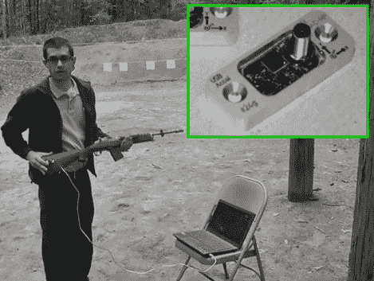

# 加速度计可以帮助你成为神枪手

> 原文：<https://hackaday.com/2012/05/18/accelerometer-may-help-make-you-a-sharpshooter/>

[Chris Suprock]对使用技术来提高你使用枪械的准确度很感兴趣。为此，他使用安装在枪上的[加速计来收集每次射击的反馈](http://www.youtube.com/watch?v=z1Wbajf89FQ)。

硬件设置非常简单。我们没有具体的细节，但看起来他使用的是 QFN 加速度计芯片，就像你在手机中发现的一样。支撑电路板的铝制安装支架上印有“USB ”,尽管我们并不认识这个连接器。

在休息后的视频中，[Chris]演示了当设备安装在 Ruger Mini-14 的枪托上时，他可以获得的反馈。数据图表清楚地显示了扣动扳机的时间。最有用的部分可能是事件发生前的那段时间，因为它显示了拍摄前任何不必要的运动。如果你对体育射击感兴趣，这可能是又一个帮助你超越竞争对手的工具。

[https://www.youtube.com/embed/z1Wbajf89FQ?version=3&rel=1&showsearch=0&showinfo=1&iv_load_policy=1&fs=1&hl=en-US&autohide=2&wmode=transparent](https://www.youtube.com/embed/z1Wbajf89FQ?version=3&rel=1&showsearch=0&showinfo=1&iv_load_policy=1&fs=1&hl=en-US&autohide=2&wmode=transparent)