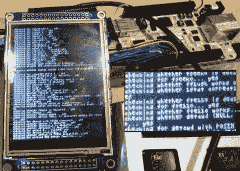

# 教比格波恩玩 LIDD 显示器

> 原文：<https://hackaday.com/2012/05/18/teaching-beaglebone-to-play-with-lidd-displays/>

[Chris]还没弄到覆盆子酱，所以他点了一份比格犬骨，然后开始谈正事。他惊讶地发现，没有太多关于在硬件上使用 LIDD 型显示器的信息。市场上的许多 320×240 智能 LCD 模块都使用这种协议，所以[他敲定了自己的驱动程序](http://www.cemetech.net/forum/viewtopic.php?t=7814)并分享了细节。

该系统被设计为运行 Linux 内核，而[Chris]选择了 Angstrom。他的旅程从自己解决如何编译和修补内核开始。从那以后，只需要得到正确的引脚映射，并编译一个驱动程序(这样做听起来太简单了)。

显然，他很快就能让 X 桌面环境运行起来了。不知道他对硬件有什么计划，但我们都支持人们分享他们的工作，让其他人更容易。谢谢！