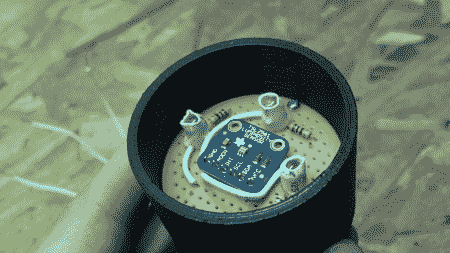

# 使用亮度构建颜色传感器

> 原文：<https://hackaday.com/2012/05/19/building-a-color-sensor-using-luminosity/>

[理查德·奥斯古德]带着一个有趣的项目又回来了。这次他已经[构建了一个颜色传感器](http://www.richardosgood.com/2012/02/06/home-built-color-sensor/)。他最初的设计是使用三个发光二极管和一个光敏电阻。他将红色、绿色、蓝色的发光二极管照射在一个表面上，用光敏电阻记录反射光，这样他就可以确定每种颜色有多少反射光。不幸的是，他发现它完全不可靠。使用光频传感器的尝试也没有成功。最终起作用的是上面显示的亮度传感器。

最后，他的原型成功了。不幸的是，只有红色 LED 给出了他认为足够的读数，而蓝色和绿色则“不完全正确”。有了这种电路，他就可以克隆出一盏神奇的变色龙灯。