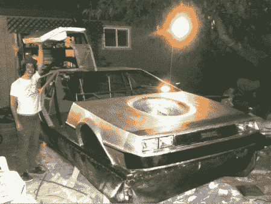

# 德罗宁气垫船

> 原文：<https://hackaday.com/2012/05/20/delorean-hovercraft/>

[马修·里斯]沮丧地等待未来的到来，这样他就可以拥有他的飞行汽车。他决定把事情掌握在自己手中，尽可能地建造最接近的东西。这原来是一艘气垫船。不仅如此，他还认为最适合这个东西的形状应该是德罗宁。我们不能说我们不同意他的观点。不幸的是，没有太多关于他体型的信息。他的 kickstarter 页面上有一个很酷的视频(别担心，他在 2010 年就获得了资助)。为了弥补建造信息稀少的事实，我们为你[找到了一些制作你自己的气垫船](http://www.vintageprojects.com/go-kart/hovercraft-plans.html)的计划。尽管[我们有](http://en.wikipedia.org/wiki/Landspeeder)一些[建议](http://www.youtube.com/watch?v=FyinD6ZDqeg)，你还是可以添加任何你想要的形状。

[via [Makezine](http://blog.makezine.com/2012/05/18/delorean-hovercraft/)