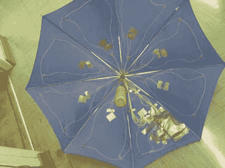

# 雨伞中的雨激活灯光表演

> 原文：<https://hackaday.com/2012/05/20/rain-activated-light-show-in-an-umbrella/>

在一个我们完全赞同的决定中，这些勤劳的年轻女性认为，在雨中玩耍只有在包含互动灯光秀的情况下才会更有趣。他们希望雨本身能让他们雨伞上的发光二极管发光。为了实现这一点，他们在伞的 8 块面板上分别安装了压电传感器。当那块面板被击中时，它的发光二极管就会亮起。你可以在休息后的视频中看到，这是相当有效的。

他们的下一步应该是以某种方式提高分辨率，使其与这张照片相似，同时保持与雨的互动性。你如何更清晰地感知雨滴？

[途径 [Adafruit](http://www.adafruit.com/blog/2012/05/10/rain-activated-light-up-umbrella/)