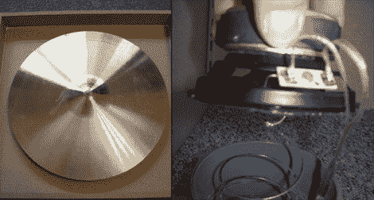

# DIY 弹簧和平板混响

> 原文：<https://hackaday.com/2012/05/19/diy-spring-and-plate-reverb/>

如果你经营自己的录音室，你将需要很多对非音乐爱好者来说过于深奥的设备。装满 synth 设备的机架看起来就像服务器机房中的任何其他技术柜一样。电子音乐在很大程度上看起来非常实用，但也有一些作品为任何工作室增添了非常好的美学风格。[Peter]制作了两个很棒的硬件——都是混响——大大增加了他工作室的装饰。另外，它们听起来也很不错。

[彼得]的[春天混响](http://www.synthforum.nl/forums/showthread.php?t=99463)(荷兰语，[谷歌翻译](http://translate.google.com/translate?sl=nl&tl=en&js=n&prev=_t&hl=en&ie=UTF-8&layout=2&eotf=1&u=http%3A%2F%2Fwww.synthforum.nl%2Fforums%2Fshowthread.php%3Ft%3D99463&act=url))和其他任何春天混响的工作方式一样；一个扬声器将一些音乐放入稍微拉伸的弹簧中，这个声音被另一端的另一个传感器拾取。在这个建筑中，[彼得]使用了一根细长塑料水管和一根浴室改造遗留下来的 PVC 管。添加一些插孔，锅，和前置放大器，[彼得]有一个非常好的和非常大的春天混响。

[平板混响](http://www.synthforum.nl/forums/showthread.php?t=108418) ( [翻译](http://translate.google.com/translate?hl=en&sl=nl&tl=en&u=http%3A%2F%2Fwww.synthforum.nl%2Fforums%2Fshowthread.php%3Ft%3D108418))也是全球专业录音棚的主要设备。这种混响有点类似于弹簧混响，只是弹簧被调音的金属板代替了。[Peter]用了架子鼓上的钹。两个扬声器连接在钹的后面，一个将声音送入钹中，另一个扬声器拾取这些声音并将其发送到混音板。

在[【彼得】的网站](http://www.groenewoudnet.nl/?page_id=15)上有很多非常酷的音乐 DIY 项目，以及他的每个 DIY 项目的一些音频演示。休息之后，我们加入了他的混响演示，请随意试听。

感谢[geekabit]发送这封邮件。

平板混响:

<https://hackaday.com/wp-content/uploads/2012/05/plate.mp3?_=1>

[https://hackaday.com/wp-content/uploads/2012/05/plate.mp3](https://hackaday.com/wp-content/uploads/2012/05/plate.mp3)

弹簧混响:

<https://hackaday.com/wp-content/uploads/2012/05/plate.mp3?_=2>

[https://hackaday.com/wp-content/uploads/2012/05/plate.mp3](https://hackaday.com/wp-content/uploads/2012/05/plate.mp3)