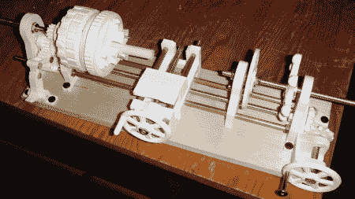

# 3d 打印迷你车床

> 原文：<https://hackaday.com/2012/05/21/3d-printing-a-mini-lathe/>

在浏览我们经常访问的网站之一 RobotsDreams 时，我们发现了这个有趣的小视频。在这里，[Sublime]正在展示他的 3d 打印迷你车床。在视频中，他提到所有的文件都可以下载，所以你可以为自己制作一个，但不幸的是没有链接。快速搜索了一下，我们找到了更多的信息。我们在 [Thiniverse](http://www.thingiverse.com/thing:9242) 上发现了这个项目，尽管通读评论似乎【Sublime】不再使用 Thiniverse。你现在可以在[的 GitHub 账户](https://github.com/Intrinsically-Sublime/Printable-Lathe-V2)上找到文件来制作你自己的文件。

这个设计看起来非常坚固，看起来可以处理一些基本的工作。正如[Sublime]在下面的视频中指出的，你已经知道哪些部件会很快磨损，可以简单地打印一些备用的。虽然这看起来有点浪费，但他也指出，他使用的是可堆肥、更容易回收的聚乳酸。

[https://www.youtube.com/embed/7Fwo_JhjPFc?version=3&rel=1&showsearch=0&showinfo=1&iv_load_policy=1&fs=1&hl=en-US&autohide=2&wmode=transparent](https://www.youtube.com/embed/7Fwo_JhjPFc?version=3&rel=1&showsearch=0&showinfo=1&iv_load_policy=1&fs=1&hl=en-US&autohide=2&wmode=transparent)