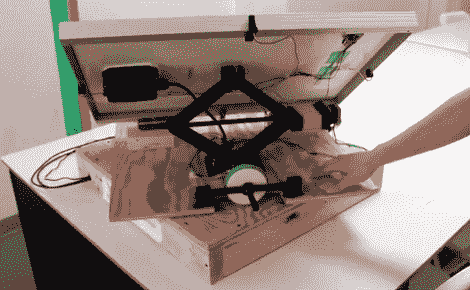

# Heliowatcher 定位太阳能电池板以获得最高效率

> 原文：<https://hackaday.com/2012/05/21/heliowatcher-positions-solar-panels-for-highest-efficiency/>

[Jason Wright]和[Jeremy Blum]正在展示他们为康奈尔大学的微控制器设计课程开发的项目。他们称之为太阳守望者，如果你知道你的希腊神话，我们会发现这个[观察太阳的运动并调整太阳能电池板跟随它](http://heliowatcher.com/)。

他们的设计简单而有效。底座像一个旋转的转盘，可以在水平面上旋转。太阳能电池板的底部边缘安装有两个门铰链，用电动螺旋千斤顶来升高和降低它。该系统使用 GPS 提供地理位置、日期和时间反馈。这与四个 led 阵列一起使用，以确定面板的最佳位置。这些发光二极管充当光传感器；当顶部和底部检测到相似的水平时，面板处于其最有效的方位。左侧和右侧 LED 传感器的工作方式相同。

现在，如果我们能设计出一种自我清洁系统，使电池板不被长时间积累的脏膜污染，我们就万事大吉了！

[https://www.youtube.com/embed/dGb2fmC4mDg?version=3&rel=1&showsearch=0&showinfo=1&iv_load_policy=1&fs=1&hl=en-US&autohide=2&wmode=transparent](https://www.youtube.com/embed/dGb2fmC4mDg?version=3&rel=1&showsearch=0&showinfo=1&iv_load_policy=1&fs=1&hl=en-US&autohide=2&wmode=transparent)