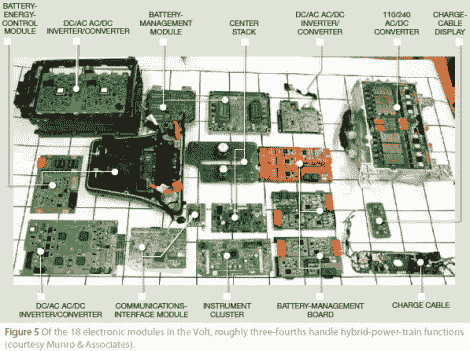

# Volt 拆卸展示的不仅仅是引擎盖下的东西

> 原文：<https://hackaday.com/2012/05/22/volt-teardown-shows-more-than-just-whats-under-the-hood/>

雪佛兰 Volt 是大众市场电动汽车的顶级竞争者之一。现在你可以通过这篇雪佛兰 Volt 拆卸文章来看看组成电气系统的部件。

冒险从 288 芯电池开始。它形成一个 T 形，并占据了车辆内部中央形成驼峰的空间。这些产品在外壳中内置了液体冷却系统，以确保在使用或充电期间不会太热。然后将目光放在控制和监控硬件上，而且有很多这样的硬件。事实上，上图是将新型插电式电动车技术整合在一起的 18 个模块的概述。如果你有足够的勇气取消其中一个的保修，这应该是一个帮助你开始的路线图。

有谁见过这种家用充电站被拆了吗？