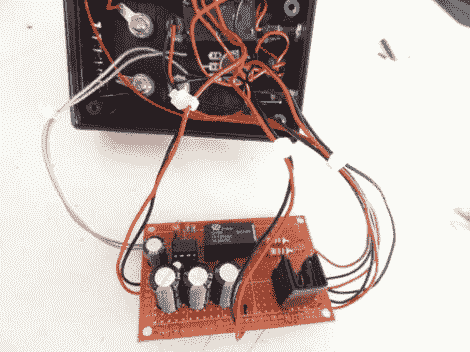

# 自动电容充电器让你享受火花带来的乐趣

> 原文：<https://hackaday.com/2012/05/22/automatic-capacitor-charger-lets-you-have-fun-with-sparks/>

电容器快速放电时产生的火花令[GranTotem]欣喜不已。但他对将它们连接到电源进行充电的相对缓慢的过程不以为然。因此，他为他的电容器建造了这个[自动充电站，几乎连续不断地提供令人震惊的好时光。查看视频，了解我们的意思。](http://www.instructables.com/id/Caps-n-Sparks)

我们总是喜欢看到项目的精髓，这就是为什么我们选择这张图片作为特写。但是，当所有东西都在项目箱中就位后,[GranTotem]就能实现真正整洁的外观。末端有两个筒式插孔连接器，一个用于 16V 输入，另一个用于 20V 输入。外壳的盖子上有一个开/关开关、调节旋钮和两个香蕉连接器端子。一旦接通电源，继电器就会定期将电容器与电源连接或断开，时间间隔由旋钮调节。只需将几个探针连接到香蕉终端，让火花熄灭。

[https://www.youtube.com/embed/wgmIrtjj-Bs?version=3&rel=1&showsearch=0&showinfo=1&iv_load_policy=1&fs=1&hl=en-US&autohide=2&wmode=transparent](https://www.youtube.com/embed/wgmIrtjj-Bs?version=3&rel=1&showsearch=0&showinfo=1&iv_load_policy=1&fs=1&hl=en-US&autohide=2&wmode=transparent)