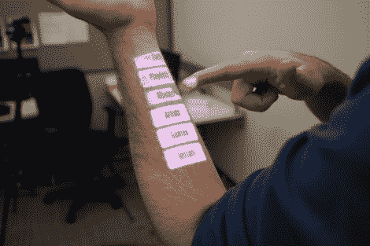

# 更新:使用你的前臂作为用户界面

> 原文：<https://hackaday.com/2012/05/22/update-using-your-forearms-as-a-ui/>

这张图片对普通读者来说应该很熟悉。这个概念[克里斯·哈里森]已经研究了一段时间，这次硬件升级使用了我们都很熟悉的设备。

最新的版本名为 Omnitouch，使用肩扛式系统进行输入和输出。功能与他的 Skinput 项目相同，但目标是以不同的方式实现的。它使用一个臂套来感应你何时何地触摸你的手臂或手。这使用深度相机来进行感测。在这两种情况下，微型投影仪都会提供交互式反馈。

这次升级有几个非常好的地方。首先，它具有相当精确的多点触控功能。其次，它允许使用更多的表面，而不仅仅是你的手臂。事实上，它可以跟踪移动的表面并做出相应的调整。当实时编辑打印的文档时，这显示在中断后的片段中。非常好的东西！

[https://www.youtube.com/embed/Pz17lbjOFn8?version=3&rel=1&showsearch=0&showinfo=1&iv_load_policy=1&fs=1&hl=en-US&autohide=2&wmode=transparent](https://www.youtube.com/embed/Pz17lbjOFn8?version=3&rel=1&showsearch=0&showinfo=1&iv_load_policy=1&fs=1&hl=en-US&autohide=2&wmode=transparent)

[谢谢 0.zer0]