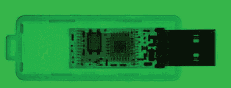

# 造一台 x 光机，让一切都进入你的大脑

> 原文：<https://hackaday.com/2012/05/24/building-an-x-ray-machine-and-letting-everything-go-to-your-head/>

并不是每天 Hackaday 上的一个构建都会被大牌出版物采用，更难得的是看到 Hackaday 的贡献者出现在真正的印刷杂志上。亚当·慕尼黑和他自制的 x 光机 T1 就是这样的例子。

我们第一次看到[Adam]的 [x 光机](http://hackaday.com/2012/01/01/see-through-everything-with-a-home-made-x-ray/)是在今年年初，作为 build lounge/全光谱激光切割机大赛的参赛作品。【亚当】[赢得了竞赛](http://hackaday.com/2012/01/13/grenadier-wins-the-laser-cutter-for-his-portable-x-ray-project/)，为自己买了一台新的激光切割机，[开始为 Hackaday](http://hackaday.com/author/irfp260/) 写稿。现在[亚当]已经登上了大众科学的版面，我们想起了伊卡洛斯的故事，飞得离太阳太近了。

[亚当]的 x 光机是围绕一个柯立芝管建造的，与牙科 x 光机中发现的真空管类型相同。该设备装在两个手提箱中——一个用作控制面板，饰有漂亮的表盘和数码管，另一个装有柯立芝管和电源。通过将相机对准闪烁屏幕，可以拍摄适当的 x 射线图像，使[亚当]能够看到硬盘驱动器和其他无生命物体的内部。

当然，这是一个我们以前见过的版本，但看到 Hackaday 自己的一个版本获得一些大的名字仍然非常酷。