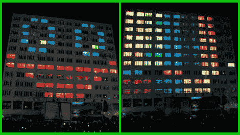

# 电源索引窗口显示将建筑物变成 LED 矩阵

> 原文：<https://hackaday.com/2012/05/23/power-index-window-display-turns-buildings-into-led-matrices/>

这个利用灯泡的有趣项目得到了一些赞助，并正在巡回演出。这个项目现在使用控制在 2.4 GHz 波段的 LED 模块[将建筑物变成全彩色显示器](http://www.piwo.pwr.wroc.pl/o-projekcie?lang=en)。这是波兰弗罗茨瓦夫理工大学学生的产品。这个小组有点像课外俱乐部，多年来一直在做这种事情。但现在，他们已经获得了一些关键的赞助，不仅允许升级硬件，还让该集团在欧洲各地的大学巡回演出。谁会想到你可以带着这样的东西去巡回演出？

很像我们在四月看到的麻省理工项目，这照亮了网格状建筑的黑暗房间。不过，这不仅仅是玩俄罗斯方块。该安装将动画设置为音乐，带有自定义动画编辑器，以便您可以为下一场演出提交自己的作品。不要错过休息后冗长的表演。

[https://www.youtube.com/embed/7QuhqI5pCfg?version=3&rel=1&showsearch=0&showinfo=1&iv_load_policy=1&fs=1&hl=en-US&autohide=2&wmode=transparent](https://www.youtube.com/embed/7QuhqI5pCfg?version=3&rel=1&showsearch=0&showinfo=1&iv_load_policy=1&fs=1&hl=en-US&autohide=2&wmode=transparent)

谢谢你，亚历山大