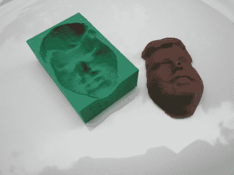

# 你的巧克力脸

> 原文：<https://hackaday.com/2012/05/23/your-face-in-chocolate/>

我们认为 in 可能是荒谬的虚荣，但在这个假期给你家里的每个人一个模仿你杯子的巧克力不是很有趣吗？[Eok.gnah]已经设计出了一个系统来实现这一点。它由三个部分组成:扫描你的头部并从中建立一个 3D 模型，使用该模型打印模具，以及成型巧克力本身。

他用 123D 扫描了他的脸。没有提到硬件，但是这个面部扫描设备非常适合它。然后，他清理了输入，并用它来制作一个模具模型，方法是从 OpenSCAD 中的一个立方体中减去他的脸。这需要为 3D 打印机分层，他使用了[越来越受欢迎的 Slic3r 程序](http://slic3r.org/)。最后，模具被打印出来，用熔化的巧克力浇铸出面部。我们建议使用随机轨道打磨机(无砂纸)振动模具底部。这将有助于清除他鼻子里的气泡。

你知道，不一定是你的脸。它可能是身体的另一部分，甚至是内部的一部分… [就像你的大脑](http://www.instructables.com/id/Edible-Chocolate-Brain-from-MRI-Scan/)！