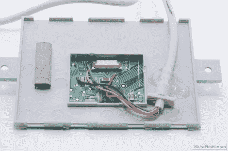

# 作为独立外设的笔记本电脑触摸板

> 原文：<https://hackaday.com/2012/05/23/laptop-touchpad-as-a-standalone-peripheral/>

[维克多]正在从一台报废的笔记本电脑上抢救零件。在他看来，最大的珍宝是触摸板，所以他开始尝试是否能让触摸板成为一个独立的设备。您可能会想到将它与微控制器接口以及编写固件来测量输入并将其转换为 HID 兼容命令的种种困难。好消息是它比那要简单得多，只有一个问题。

他环顾四周，想看看能在驱动触摸板的芯片上找到什么。他无法找到精确的匹配，但来自类似控制器系列的数据手册使他认为芯片应该有 PS/2 数据和时钟输出。在探测了电路板上的测试点后，他找到了它们，以及电压和接地轨。上面你可以看到他把一根旧的鼠标线焊接到电路板上，插上电源就能正常工作。

但是我们提到了抓到你了。左右键好像没有任何支持。这些被安置在一个柔性印刷电路板上，连接到上面看到的白色连接器。那个印刷电路板也连接到电脑上，所以我们不知道他们是否会与这个黑客合作。