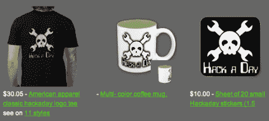

# 黑客日商店:它又存在了

> 原文：<https://hackaday.com/2012/05/24/hackaday-store-it-exists-again/>

我们以前有一家商店。实际上，只有我一个人，从我的车库里抽出衬衫和贴纸。然而，我发现随着时间的推移，我对衬衫的质量不是特别满意。随着时间的推移，乙烯基会破裂，我也不是世界上最快拿到订单的人。我关了店，因为我不想以 hackaday 的名义太穷。我收到了大量的电子邮件，要求我重新打开它。

今天，[我们将开启另一家商店](http://zazzle.com/hackadaystore)。这并不新奇。这并不令人惊讶。然而，它应该提供比我们以前更高质量的产品，以及更多不同的产品可供选择。到目前为止，我已经放了衬衫、咖啡杯和贴纸。每种格式的图形都做得很正确，所以它们应该非常漂亮。当你购买 Hackaday 商品时，你帮助确保 Hackaday 将尽可能长时间地存在。

现在，让我们谈一谈我们应该从这里走向何方。

1.是的，我们知道我们可以去丝网印刷衬衫。我宁愿有定制的商品，我们可以检查和库存。这是一个“有一天”的事情，我们将不得不努力。现在我们几乎没有这方面的预算，我不相信我们能提供零售店所需的客户服务。我们忙着找酷的东西来写！

2.工具/组件
总有人提到我们应该卖工具。我没意见，但对我来说也没什么意义。你们都知道我们不做工具。您从我们这里购买的工具只是我们先购买的其他人的工具。我们认为，我们认识的销售工具的人在客户服务和订单履行方面可能比我们做得更好。也许有人有我没想到的角度。

3.我们讨论过这个问题，每次都很兴奋。我们很想拿出一些工具包来卖。我们有一些想法，但必须先解决一些事情。这很可能是我们的下一步。我们很想听听您对此的想法和意见。显然，这些会更简单。如果我们的任何一个作者为一个巨大的项目投入了必要的时间和精力，他们很可能会自己发展。

所以现在就这样了。去买一件衬衫和一个咖啡杯。我们很感激。哦，把你的东西的照片贴在我们的论坛上，或者贴在 [Hackaday flickr pool](http://www.flickr.com/groups/hack-a-day/) …或者贴在你城镇广场每栋建筑的每一面墙上。