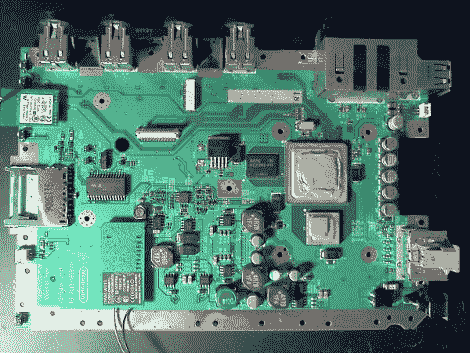

# 拿起你的熨斗，将 GameCube 放回 Wii

> 原文：<https://hackaday.com/2012/05/24/grab-your-iron-and-add-gamecube-back-to-the-wii/>

任天堂 Wii 刚推出的时候，最酷的事情之一就是可以在上面玩 GameCube 游戏。这使得升级对很多人来说是显而易见的。但随着传统系统的全盛时期成为历史，任天堂决定这不再是一个卖点，并停止填充这些组件。好消息是，如果你不介意大量的 PCB 焊接，你可以将 GameCube 芯片添加到现代 Wii 主板上。

[Deadlyfoez]发起了一次抽奖活动，以筹集足够的资金来购买新版本的硬件(我们猜测抽奖的奖品是改装的控制台)。然后，他开始焊接四个 GameCube 控制器端口和一个存储卡读卡器。还需要增加一些无源表面贴装元件。但正如休息后的视频所示，一旦就位，功能就会重新出现在软件端。

[https://www.youtube.com/embed/8wi0AcBJZo8?version=3&rel=1&showsearch=0&showinfo=1&iv_load_policy=1&fs=1&hl=en-US&autohide=2&wmode=transparent](https://www.youtube.com/embed/8wi0AcBJZo8?version=3&rel=1&showsearch=0&showinfo=1&iv_load_policy=1&fs=1&hl=en-US&autohide=2&wmode=transparent)