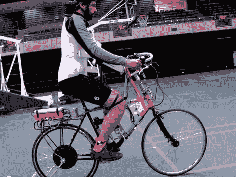

# 自行车可以告诉我们如何让它变得更好

> 原文：<https://hackaday.com/2012/05/28/the-bicycle-can-tell-us-how-to-make-it-better/>

多年来，自行车的设计已经发生了变化。随着技术的进步，材料也在升级，积累的知识帮助自行车制造商不断改进。但是旨在进行有意义的改进的深入分析还没有被广泛接受。加州大学戴维斯分校的研究人员希望通过[让自行车告诉我们如何改进来拓展这一前沿领域](http://biosport.ucdavis.edu/research-projects/bicycle)。这是他们一直在研究的测试自行车之一，主要针对数据采集。他们希望找到一些真正的改进，主要是基于机器如何尽可能多地避开驾驶者的方式。这里的想法是，骑手的身体占车辆体积的 80-90%,应该以各种可能的方式适应。

当然，这可能是一个试图建立一个更好的捕鼠器的例子。但是，在休息之后听听视频中的讨论，就能真正理解这些看似简单的交通工具在稳定性和移动性方面的复杂问题。我们猜测最终的建议不会涉及[将自行车增高五倍](http://hackaday.com/2011/01/12/skywalker-a-really-really-tall-bike/)。

[https://www.youtube.com/embed/HcYbn_RCLiw?version=3&rel=1&showsearch=0&showinfo=1&iv_load_policy=1&fs=1&hl=en-US&autohide=2&wmode=transparent](https://www.youtube.com/embed/HcYbn_RCLiw?version=3&rel=1&showsearch=0&showinfo=1&iv_load_policy=1&fs=1&hl=en-US&autohide=2&wmode=transparent)