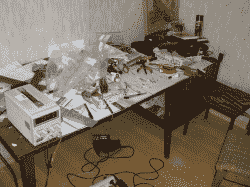
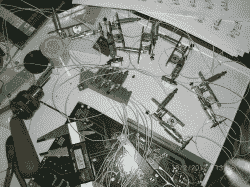
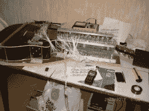

# 采访:[弗拉基米尔·戴明]吉他弹奏者的创造者

> 原文：<https://hackaday.com/2012/05/25/interview-vladimir-denin-the-creator-of-the-player-guitar/>

到目前为止，我们已经两次对[弗拉基米尔·戴明]的工作感到惊讶。最初，他用[自动巴彦](http://hackaday.com/2010/09/05/self-playing-bayan-built-nearly-22-years-ago/)，最近用[他惊人的自动吉他](http://hackaday.com/2012/05/21/player-guitar-sounds-wonderful-makes-us-drool-because-of-the-complexity/)。你没看到的是[瓦尔季米尔]在给我们的电子邮件中是多么愉快和有趣。不过你会有机会的，因为[弗拉基米尔]同意在一次即兴的电子邮件采访中为我们回答一些问题。休息之后加入我们，更好地了解这位迷人的先生。

[Vladimir]在这次采访中对自己的语言能力表示歉意。不用说，英语不是他的第一语言。既然如此，我们认为他做得很好。我们争论要不要用意译来清理他的英语和拼写。我觉得我会去掉他太多的个性。以下是他的回复，未经编辑。

**1。你使用哪种加工设备？(数控、传统、手动工具？)**

> 我使用简单的手工工具，尤其是电钻。一切都是由我一手完成的。
> 举例来说，我要钻 3000 多个孔！具有高精度或公差。
> 下面，在这个视频中，我有时会展示我的设备。

[https://www.youtube.com/embed/v3SZdbKBMow?version=3&rel=1&showsearch=0&showinfo=1&iv_load_policy=1&fs=1&hl=en-US&autohide=2&wmode=transparent](https://www.youtube.com/embed/v3SZdbKBMow?version=3&rel=1&showsearch=0&showinfo=1&iv_load_policy=1&fs=1&hl=en-US&autohide=2&wmode=transparent)

> 顺便说一句，我推荐给你的读者看看这个视频。这是一首著名的俄罗斯老歌。我(还是吉他？)已经做出了非常好的像原创一样的声音。

**2。你受过什么教育？你上学是为了学这个还是自学？**

> 我受过高等教育，我的主要工作是用微处理器设计电子电路
> ，然后为它们设计和开发不同的软件。音乐机器人是我的业余爱好。

**3。你在哪里？你的位置对你的项目有影响吗？**

> 现在我住在莫斯科，之前住在伊尔库茨克地区(东西伯利亚，著名的贝加尔湖)。
> 我认为，地点并不重要。更重要的是，在任何地方都不要忘记你的大脑。

**4。当你完成了一个像自动吉他这样的项目后，你还会用它来自娱自乐吗？还是它会变成某个地方展示的展示品？**

> 我为我的家人做的项目，我的儿子们多次要求我这样做。(我有三个儿子。尽管我已经 62 岁了，但我的内心是年轻的，好奇的，就像一个小孩子。
> 螺线管是根据我的个人要求在中国订购的，所以我花了很多钱。
> 我用了很多空闲时间。)我在办公室有一份拿薪水的工作。)
> 所以我的好奇心很贵。
> 有人建议我从吉他制造商或同一家餐馆等处寻求订单。做吉他机器人
> 用于宣传目的。但我不确定，即使我大大提高了设备的质量。
> (至于“大幅度提高”，我确定)。我认为这个产品没有赚钱的用途。尽管如此，我很快乐——这对健康非常重要。至于“自娱自乐”，我为我儿子的教育目标做了一个。他们(儿子)从 1987 年开始上巴扬音乐学校。
> 所以我不和日本竞争(这个评论让我大儿子)

**5。你有没有想过组建一个完整的乐队，或者用一组乐器建造一个“风琴”？**

> 不，我觉得还是做几个(几个)设备还要高质量。
> 
> 质量比数量更重要。不是吗？

**6。你第一个完成的项目是什么？**

> **不记得了。可能是 10 岁时我家附近的一次小爆炸。**

 ****7。如果你有无限的资源，你想建造什么？**

> OOO！难以回答，只是睁大眼睛说哇！！！！有一次，我的小儿子问我，“爸爸，如果你很富有，你会做什么？”
> 我回答，“为人民唱了一首歌。”
> -但人们不喜欢(讨厌)你的歌声，没人听你的
> 我——“一群人会很乐意听我唱歌
> ，因为我给了他们很多钱”

**8。你下一步计划建造什么？**

> 当我问这个问题时，我通常会开玩笑——旁边的建筑是带螺线管的小提琴。
> 令人惊讶的是，有些人相信我。
> 不过说真的，我打算做一个新的高品质手风琴，和吉他来个二重奏。
> 和 2 把吉他做二重唱。
> 但首先，要删除弹奏机制的噪音，提高吉他的质量。
> 也许我在吉布森吉他公司的未来适用性与自动调音。

**9。我们能有更多吉他或巴扬的机械的照片吗？我们希望看到你正在进行的任何项目，完成或未完成的。我们的读者是非常专业的人。** **我们喜欢听音乐，但我们也喜欢看细节！**

> 图片请见附件。我现在描述一些细节。
> 这个吉他机器人(在我看来)包括 4 或 5 项技术。
> 主要的诀窍是我在 1988 年为真正的(不是数字的)
> 仪器开发的接口。1988 年我不知道 Midi。现在我说-Midi 完全不适合真正的音乐设备(比如我的机器人)。
> 我的界面也允许非常容易、准确、快速地输入旋律的音符而不出错。
> 吉他由早期为无线集群系统设计的手持电话的数字部分控制。这个手机是我设计的。
> 它(手机)管理安装在吉他上的螺线管的存储器。
> 包括 microCPU ADSP2187、flash 存储器、DAC 和 ADC。
> 不用吉他也可以从手机
> 内部的小扬声器中听到吉他未来的旋律。非常有用。
> 
> 拨弦装置有四个阶段的操作时间。(通过软件管理)
> -打开螺线管弦张力(相同延迟)
> -打开螺线管弹拨(相同延迟)
> -关闭螺线管弦张力(相同延迟)
> -关闭螺线管弹拨(无关延迟)
> 
> 在不超过 7 毫秒的短时间内，当前的吉他电源在 12 伏的电压下可以消耗高达 30 安培的电流。
> 尽管电流很大(因为时间短)，5 安培/小时的电池容量相当于连续播放 2-4 小时。
> 这取决于音乐的类型。
> 
> 说得太多了。好吧！你可以编辑，剪切文本，如你所愿。我认为首先需要将我的文本从“俄罗斯英语”重新翻译成“剑桥英语”。如果你决定发布网络日志。，那么我对各位读者的问题——
> “如果一个机器人演奏音乐比人类好得多，
> 你更喜欢听哪个？."
> (一个大秘密！至于我，我更喜欢人类，只要这一个是美女)
> 
> 最美好的祝愿=弗拉基米尔戴明。

又及:最新消息。对我来说比设计设备更难。

**